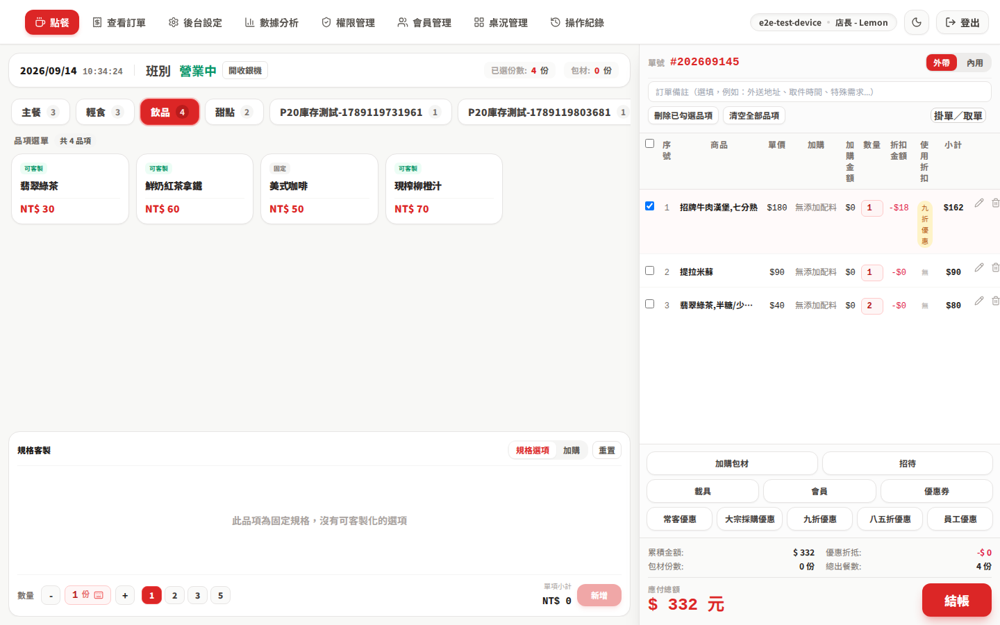
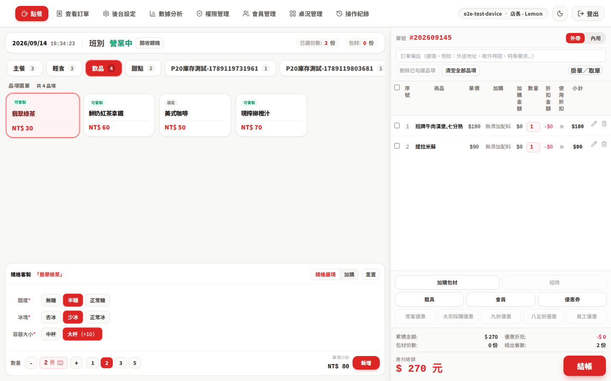
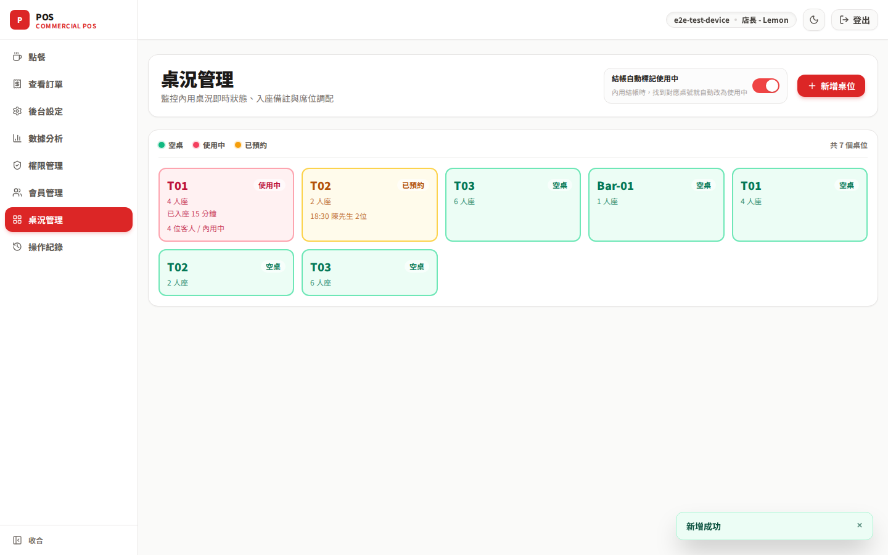
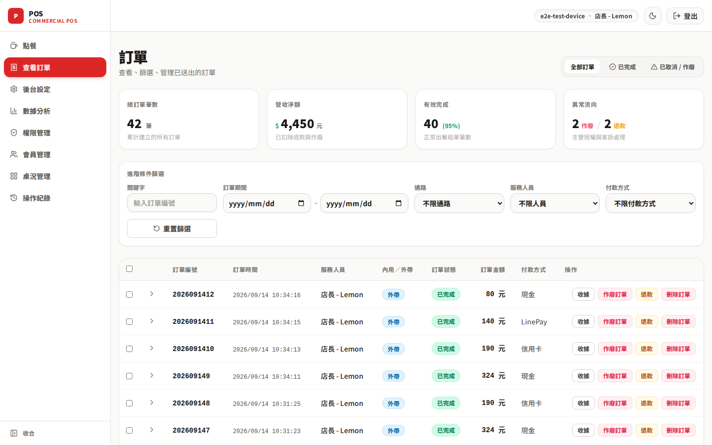
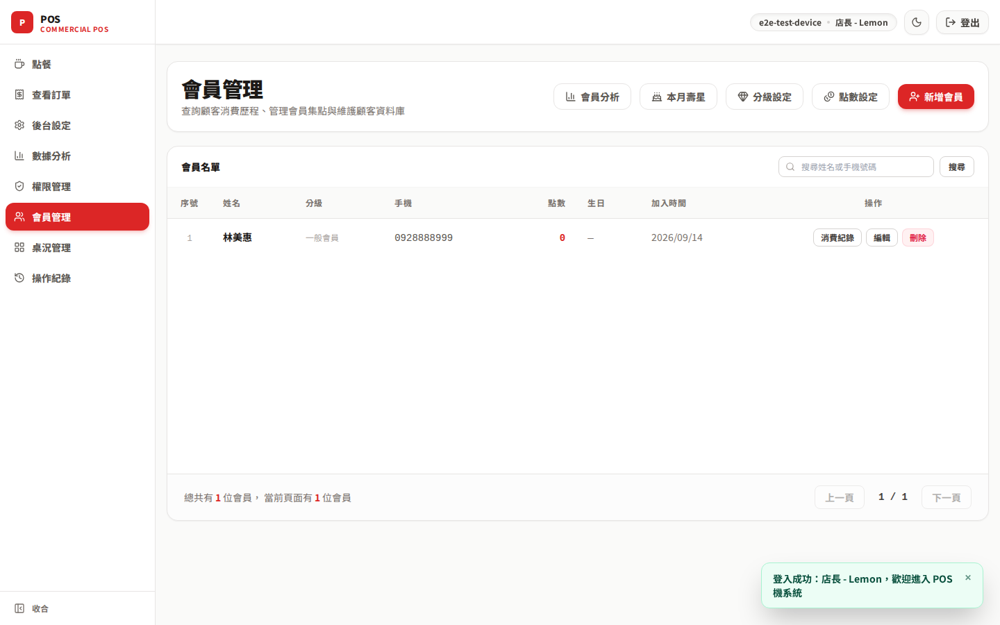
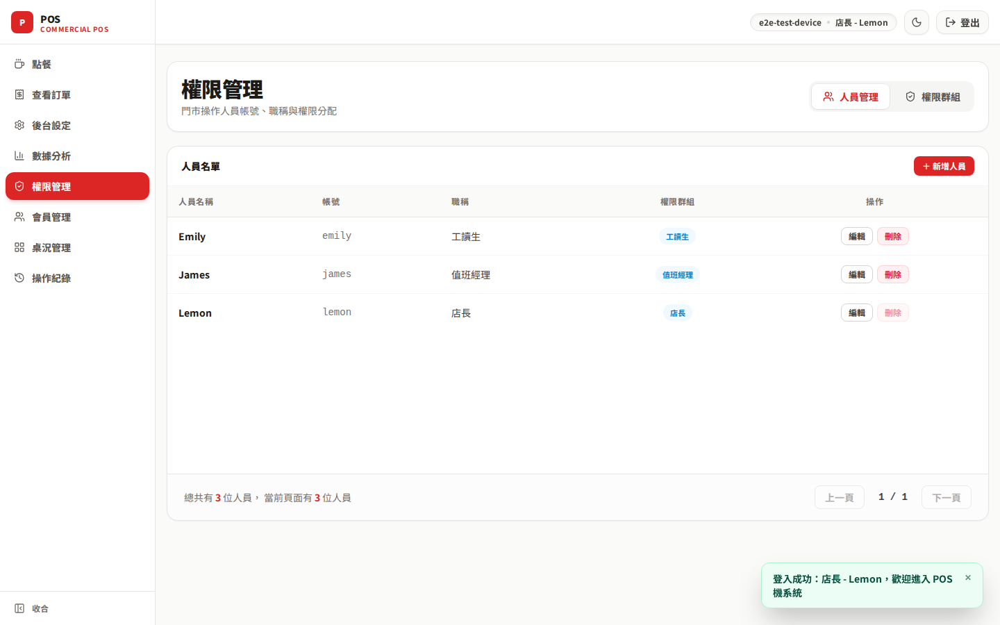
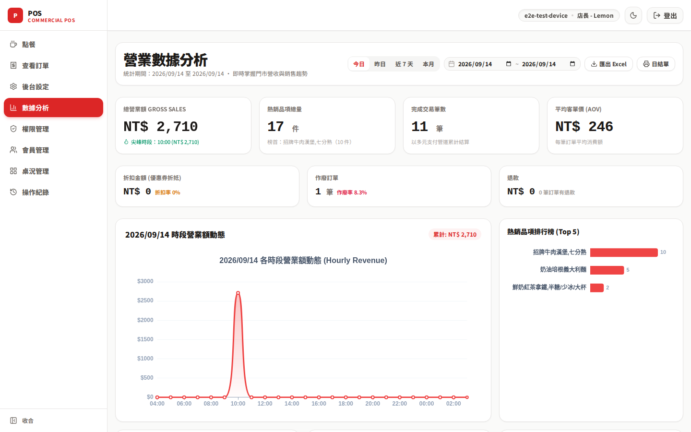
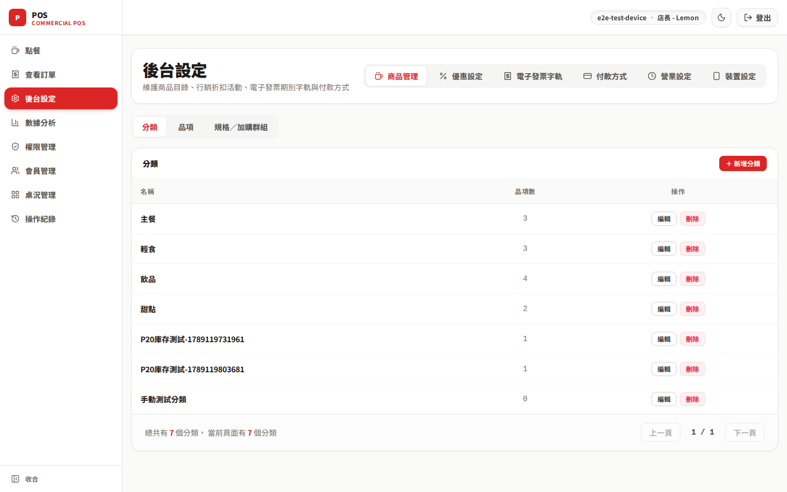

# POS System

支援餐飲與飲料店的多租戶 POS 系統 —— 點餐結帳、會員行銷、後台管理與數據分析。

[](https://github.com/lemoncat0817/pos-system/actions/workflows/ci.yml)
[](https://workers.cloudflare.com)

**線上版本：[lemoncat0817.github.io/pos-system](https://lemoncat0817.github.io/pos-system/)**

<picture>
  <source media="(prefers-color-scheme: dark)" srcset="./docs/screenshots/01-ordering-system-dark.png">
  
</picture>

## 畫面預覽

### 點餐收銀與規格客製

支援跨品類（餐飲、飲料）的規格群組選配（熟度、甜度、冰塊、大小、加購料）、即時搜尋、購物車快速折扣與多種支付方式。

|                        點餐收銀主畫面                        |                       規格客製化設定                       |
| :----------------------------------------------------------: | :--------------------------------------------------------: |
|  |  |

### 門市桌況與訂單管理

提供即時桌況視覺化卡片（空桌／使用中／已預約）、入座時間與備註掌握；訂單中心支援多維度進階篩選、發票載具記錄、退款作廢與稽核追蹤。

|                        桌況即時監控                         |                        歷史訂單管理                         |
| :---------------------------------------------------------: | :---------------------------------------------------------: |
|  |  |

### 顧客會員與權限管理

會員資料庫支援等級門檻、消費點數累積與歷史消費歷程查詢；門市人員依 RBAC 角色模型分配功能模組權限。

|                     會員資料與集點紀錄                      |                    員工角色與權限（RBAC）                   |
| :---------------------------------------------------------: | :---------------------------------------------------------: |
|  |  |

### 營業分析與後台設定

整合 ECharts 圖表呈現時段營業額動態趨勢、熱銷品項排行榜、各支付通路結構分析；後台具備商品目錄、規格群組、行銷折扣券與發票字軌之完整維護能力。

|                       營業數據分析儀表板                        |                        後台商品與規格設定                         |
| :-------------------------------------------------------------: | :---------------------------------------------------------------: |
|  |  |

## 功能

| 模組     | 內容                                         |
| -------- | -------------------------------------------- |
| 點餐結帳 | 品項客製化、加購選項、多種付款方式、桌況管理 |
| 會員行銷 | 會員等級與點數、折扣券、快速折扣             |
| 後台管理 | 權限（RBAC）、電子發票、班別與操作稽核紀錄   |
| 數據分析 | 營業額趨勢與熱銷排行（ECharts）              |
| 離線同步 | IndexedDB 暫存 + 背景同步，支援 PWA 安裝     |

## 技術堆疊

| 層         | 選型                                                                           |
| ---------- | ------------------------------------------------------------------------------ |
| 前端       | Vue 3 + TypeScript strict · Pinia · Vue Router · TanStack Query · Tailwind CSS |
| 離線 / PWA | Dexie · vite-plugin-pwa                                                        |
| 後端       | Hono · Cloudflare Workers · D1 · Drizzle ORM                                   |
| 共用套件   | 純 TypeScript 領域邏輯 + Zod API 契約，前後端共用                              |
| 測試       | Vitest（含屬性測試）· Playwright                                               |

## 快速開始

需要 Node.js ≥ 20.19 與 pnpm。

```sh
pnpm install
cp apps/api/.dev.vars.example apps/api/.dev.vars   # 填入 OAuth client id/secret
pnpm dev                                           # http://localhost:5173
```

### 指令

| 指令             | 說明                           |
| ---------------- | ------------------------------ |
| `pnpm build`     | 建置所有套件                   |
| `pnpm typecheck` | 全套件型別檢查                 |
| `pnpm lint`      | ESLint（含跨套件依賴邊界檢查） |
| `pnpm test`      | Vitest 單元測試                |
| `pnpm test:e2e`  | Playwright 端對端測試          |

## 架構

```
apps/pos/       前端（Vue 3 + PWA）
apps/api/       後端（Hono + Cloudflare Workers + D1）
packages/       pos-domain（領域邏輯）、pos-contract（前後端共用的 Zod 契約）
e2e/            Playwright 端對端測試
```

## 部署

Push／PR 到 `master` 會跑 `typecheck` → `lint` → `test`；merge 後自動部署前端到 GitHub Pages、後端 Worker 到 Cloudflare。詳見 [`.github/workflows/ci.yml`](.github/workflows/ci.yml)。
